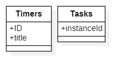

# logmate task management

# Getting Started

It contains these folders and files, following our recommended project layout:

| File or Folder | Purpose                            |
| -------------- | ---------------------------------- |
| app/           | content for UI frontends           |
| db/            | the domain models and data         |
| srv/           | the service models and code        |
| package.json   | project metadata and configuration |
| README.md      | this getting started guide         |

## Domain models

## Service states

## Learn More

Learn more at https://cap.cloud.sap/docs/get-started/.
